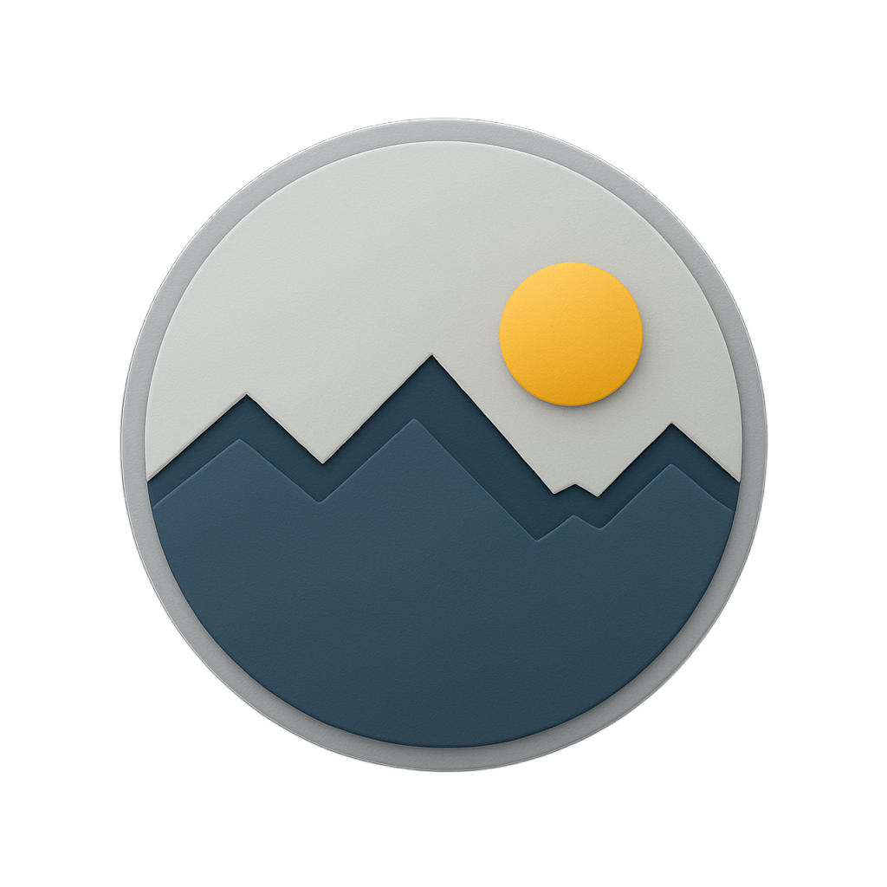

# LogMyDay

**Version:** {{ site.project_version }}

  

LogMyDay is your personal activity journal. Capture workouts, study sessions, habits, or anything else you want to track, then review the trends from a calendar-driven dashboard or a mobile quick-entry companion.

## What You Can Do

- **Log Daily Activities**: Record descriptions, durations, and notes with just a few taps.
- **Add Meaningful Tags**: Attach numeric values, free-form text, booleans, dates, or ranges to describe each entry the way you need.
- **Stay On Track**: Mark tags as required and let LogMyDay remind you when important tasks are still unfilled.
- **Review History**: Browse by day, week, or month to spot patterns and fill in missed entries.
- **Bring Data With You**: Export to Excel or make a full backup and restore it later without losing user scoping.

## Platform Overview

- **Web Dashboard (Blazor Server)**: Offers the full activity management experience with advanced filtering, modal-based entry, and administrative tools.
- **Mobile App (MAUI + BlazorWebView)**: Provides one-tap quick activities, notification reminders, and an interface tuned for phones and tablets.
- **Secure API (ASP.NET Core)**: Powers both clients with HTTPS, cookie-based auth for the web app, and rate-limited endpoints.
- **Flexible Storage**: Choose between **SQLite** (zero setup, single-file database) for personal use or **SQL Server** for multi-user production deployments.

## Start Here

- **Setup and Installation** – Follow the prerequisites, cloning steps, and documentations.
- **Mobile Guide** – Connect the Android client to your server and learn the quick activity workflow.
- **Deployment** – Explore Docker tooling and hosting recommendations when you are ready to go beyond local development.

Use the navigation on the left to dive deeper into each topic when you are ready.
